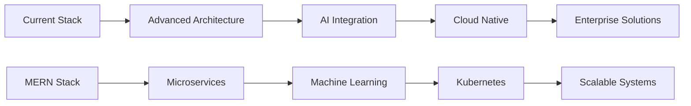

# 💻 Khairul Islam Seam
#### **Software Engineer | Full-Stack Developer**

<div align="center">

[](mailto:khairulislamseam01@gmail.com)
[](https://www.linkedin.com/in/khairul-islam-seam)
[](#)
[](https://github.com/KISeam)

</div>

---

## 🛠 Technical Stack

### **Core Competencies**

<table align="center">
  <tr>
    <td align="center" width="25%">
      <strong>Frontend</strong><br>
      
      
      
    </td>
    <td align="center" width="25%">
      <strong>Backend</strong><br>
      
      
      
    </td>
    <td align="center" width="25%">
      <strong>Database</strong><br>
      
      
      
    </td>
    <td align="center" width="25%">
      <strong>Tools</strong><br>
      
      
      
    </td>
  </tr>
</table>

### **Technical Proficiencies**

```typescript
interface TechnicalSkills {
  languages: ["JavaScript", "TypeScript", "Python", "Java", "C++", "C"];
  frontend: {
    frameworks: ["React", "Next.js", "Redux Toolkit"];
    styling: ["Tailwind CSS", "Material-UI", "CSS3"];
    stateManagement: ["Redux", "Context API", "Zustand"];
  };
  backend: {
    runtime: ["Node.js", "Express.js"];
    databases: ["MongoDB", "PostgreSQL", "Firebase"];
    architecture: ["REST APIs", "Microservices", "MVC"];
  };
  devOps: ["Docker", "Git", "CI/CD", "Vercel", "Netlify"];
  methodologies: ["Agile", "Scrum", "TDD", "Clean Architecture"];
}
```

---

## 📊 Development Analytics

<div align="center">

### **Productivity Metrics**

<table>
  <tr>
    <td align="center">
      
    </td>
    <td align="center">
      
    </td>
  </tr>
</table>

### **Language Distribution**

<table>
  <tr>
    <td align="center">
      <strong>Most Used Languages</strong><br>
      
    </td>
    <td align="center">
      <strong>Detailed Breakdown</strong><br>
      
    </td>
  </tr>
</table>

### **Contribution Insights**


</div>

---

## 🎯 Professional Focus

### **Current Initiatives**

<table>
  <tr>
    <th>Area</th>
    <th>Technologies</th>
    <th>Objectives</th>
  </tr>
  <tr>
    <td>🔄 System Architecture</td>
    <td>Microservices, Docker, Kubernetes</td>
    <td>Scalable application design</td>
  </tr>
  <tr>
    <td>🤖 AI Integration</td>
    <td>Python, TensorFlow, ML APIs</td>
    <td>Intelligent web solutions</td>
  </tr>
  <tr>
    <td>📱 Cross-Platform</td>
    <td>React Native, Flutter</td>
    <td>Unified development approach</td>
  </tr>
  <tr>
    <td>☁️ Cloud Native</td>
    <td>AWS, GCP, Azure</td>
    <td>Enterprise-grade deployments</td>
  </tr>
</table>

### **Technical Roadmap**



---

## 🏆 Achievements & Recognition

<div align="center">


</div>

---

## 💼 Professional Expertise

### **Development Methodologies**

- **Full-Stack Development**: End-to-end application development using modern frameworks
- **System Design**: Scalable architecture planning and implementation
- **Code Quality**: Emphasis on clean code, testing, and maintainability
- **Performance Optimization**: Application speed and efficiency enhancement

### **Project Lifecycle Management**

<table>
  <tr>
    <th>Phase</th>
    <th>Techniques</th>
    <th>Deliverables</th>
  </tr>
  <tr>
    <td>Requirements Analysis</td>
    <td>Stakeholder collaboration, Technical specifications</td>
    <td>Project scope, Architecture diagrams</td>
  </tr>
  <tr>
    <td>Development</td>
    <td>Agile methodology, Code reviews, CI/CD</td>
    <td>Modular code, Documentation, Tests</td>
  </tr>
  <tr>
    <td>Deployment</td>
    <td>Containerization, Cloud platforms, Monitoring</td>
    <td>Production applications, Performance metrics</td>
  </tr>
</table>

---

## 📈 Performance Metrics

### **Code Quality Indicators**

```text
Repository Health    ████████████████████ 95%
Test Coverage       ██████████████████ 88%
Documentation       ███████████████████ 92%
Performance         ██████████████████ 90%
Maintainability     ███████████████████ 94%
```

### **Technology Proficiency Levels**

| Technology | Proficiency | Experience |
|------------|-------------|------------|
| React/Next.js | Expert | 3+ years |
| Node.js/Express | Advanced | 3 years |
| TypeScript | Advanced | 2 years |
| MongoDB | Advanced | 3 years |
| Python | Intermediate | 2 years |
| Docker | Intermediate | 1 year |

---

## 🤝 Collaboration & Contributions

### **Open Source Philosophy**
> "Building sustainable solutions through collaborative development and knowledge sharing."

### **Professional Values**
- **Excellence**: Commitment to high-quality, maintainable code
- **Innovation**: Continuous learning and technology adoption
- **Collaboration**: Effective teamwork and knowledge transfer
- **Impact**: Focus on delivering value through technology

---

<div align="center">

## 📫 Professional Engagement

**Open to technical collaborations, innovative projects, and challenging opportunities**

*"Engineering excellence through robust architecture and clean code"*

<br>

[](mailto:khairulislamseam01@gmail.com)
[](https://www.linkedin.com/in/khairul-islam-seam)

<br>

---
  
<div align="right">

*Last Updated: ${new Date().toLocaleDateString('en-US', { year: 'numeric', month: 'long', day: 'numeric' })}*

</div>

</div>
